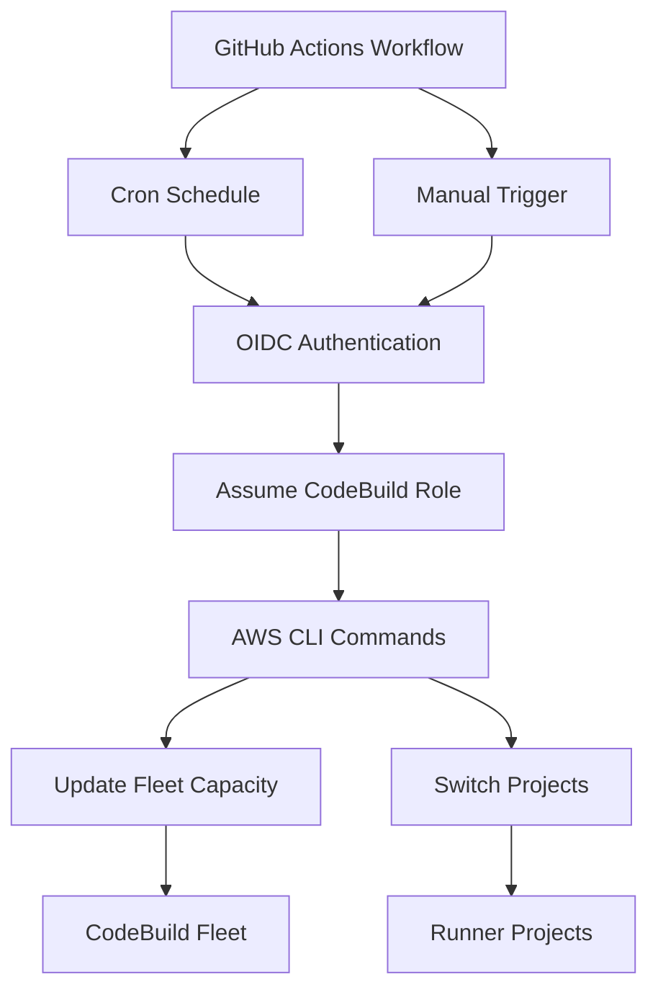

# GitHub Actions Fleet Control

This solution uses GitHub Actions with cron scheduling to automatically control your AWS CodeBuild compute fleet, eliminating the need for manual intervention.

## 🎯 Features

- ✅ **Automatic Scheduling**: Cron-based fleet control for business hours
- ✅ **Manual Control**: On-demand fleet management via GitHub Actions UI
- ✅ **Cost Optimization**: Automatic start/stop based on time schedules
- ✅ **Project Switching**: Automatically switches CodeBuild projects between fleet and on-demand
- ✅ **OIDC Authentication**: Secure role assumption without stored credentials
- ✅ **Real-time Status**: Detailed fleet and project status reporting

## 📋 Prerequisites

1. **AWS Account with appropriate permissions**
2. **GitHub repository with Actions enabled**
3. **Existing CodeBuild fleet and projects**
4. **GitHub OIDC provider configured in AWS**

## 🚀 Quick Setup

### 1. Deploy IAM Permission Updates

The solution extends your existing `shared-codebuild-role` with fleet control permissions:

```bash
# Deploy the IAM permission updates
terraform plan
terraform apply
```

### 2. Configure GitHub OIDC

Run the setup script to configure GitHub OIDC authentication:

```bash
# Update the script with your GitHub repository name
vim scripts/setup_github_oidc.sh

# Run the setup script
./scripts/setup_github_oidc.sh
```

### 3. Add GitHub Secrets

Add the following secret to your GitHub repository:

- **Name**: `AWS_ACCOUNT_ID`
- **Value**: Your AWS account ID (12-digit number)

Go to: `Settings` → `Secrets and variables` → `Actions` → `New repository secret`

### 4. Test the Workflow

1. Go to the **Actions** tab in your GitHub repository
2. Find **"Simple Fleet Control"** workflow
3. Click **"Run workflow"**
4. Choose **"status"** action to test
5. Click **"Run workflow"**

## 📅 Default Schedule

The workflow runs automatically with the following schedule (Eastern Time):

| Time | Action | Description |
|------|--------|-------------|
| **7:00 AM ET** | Start Fleet | Monday-Friday, capacity: 2 |
| **7:00 PM ET** | Stop Fleet | Monday-Friday, capacity: 0 |
| **Saturday 2:00 AM** | Safety Stop | Ensure fleet is off on weekends |

### Schedule Details

- **Start times**: 11 AM UTC (EDT) / 12 PM UTC (EST)
- **Stop times**: 11 PM UTC (EDT) / 12 AM UTC (EST)
- **Weekend**: Fleet automatically stopped
- **DST handling**: Multiple cron entries handle timezone transitions

## 🎛️ Manual Control

### Via GitHub Actions UI

1. Go to **Actions** → **Simple Fleet Control**
2. Click **"Run workflow"**
3. Choose your action:
   - **start**: Start fleet with specified size
   - **stop**: Stop fleet completely
   - **scale**: Change fleet to specific size
   - **status**: Show current fleet status

### Via Command Line (Local Testing)

```bash
# Test the fleet control script locally
./scripts/github_fleet_control.sh status
./scripts/github_fleet_control.sh start 3
./scripts/github_fleet_control.sh stop
./scripts/github_fleet_control.sh scale 5
```

## 🔧 Workflow Customization

### Change Schedule Times

Edit `.github/workflows/fleet-control-simple.yml`:

```yaml
schedule:
  # Start at 8 AM ET instead of 7 AM
  - cron: '0 12 * * MON-FRI'  # 12 PM UTC (8 AM EDT)
  - cron: '0 13 * * MON-FRI'  # 1 PM UTC (8 AM EST)

  # Stop at 6 PM ET instead of 7 PM
  - cron: '0 22 * * MON-FRI'  # 10 PM UTC (6 PM EDT)
  - cron: '0 23 * * MON-FRI'  # 11 PM UTC (6 PM EST)
```

### Change Default Fleet Size

Edit the workflow file:

```yaml
env:
  DEFAULT_FLEET_SIZE: '3'  # Change from default 2
```

### Add Custom Schedules

```yaml
schedule:
  # Additional schedule for mid-day scaling
  - cron: '0 17 * * MON-FRI'  # Scale up at 1 PM ET
```

## 📊 Monitoring and Logs

### GitHub Actions Logs

- View workflow runs in the **Actions** tab
- Each run shows detailed fleet status and actions taken
- Logs include cost estimates and project status

### CloudWatch Logs

- CodeBuild fleet metrics available in CloudWatch
- Monitor fleet capacity and utilization

### Cost Tracking

Each workflow run reports estimated costs:
```
💰 Estimated hourly cost: $0.10 (2 instances × $0.05)
💰 Current cost: $0.00 (fleet stopped)
```

## 🏗️ Architecture



## 🔐 Security

### IAM Permissions

The solution uses your existing `shared-codebuild-role` with added permissions:

```json
{
  "Effect": "Allow",
  "Action": [
    "codebuild:UpdateFleet",
    "codebuild:BatchGetFleets",
    "codebuild:DescribeFleet",
    "codebuild:ListFleets",
    "codebuild:BatchGetProjects",
    "codebuild:UpdateProject",
    "codebuild:ListProjects"
  ],
  "Resource": [
    "arn:aws:codebuild:*:*:fleet/*",
    "arn:aws:codebuild:*:*:project/runner-*"
  ]
}
```

### OIDC Trust Policy

The role trusts GitHub Actions via OIDC:

```json
{
  "Effect": "Allow",
  "Principal": {
    "Federated": "arn:aws:iam::ACCOUNT:oidc-provider/token.actions.githubusercontent.com"
  },
  "Action": "sts:AssumeRole",
  "Condition": {
    "StringEquals": {
      "token.actions.githubusercontent.com:aud": "sts.amazonaws.com"
    },
    "StringLike": {
      "token.actions.githubusercontent.com:sub": "repo:your-org/your-repo:*"
    }
  }
}
```

## 🐛 Troubleshooting

### Common Issues

1. **"Fleet not found" error**
   - Check that `FLEET_NAME` matches your actual fleet name
   - Verify fleet exists: `aws codebuild list-fleets`

2. **"Access denied" error**
   - Ensure Terraform changes were applied: `terraform apply`
   - Check GitHub secret `AWS_ACCOUNT_ID` is correct
   - Verify OIDC provider is configured correctly

3. **"No runner projects found"**
   - Projects must start with `runner-` prefix
   - Check: `aws codebuild list-projects | grep runner-`

4. **Workflow not running on schedule**
   - GitHub Actions may have delays during high usage
   - Manual triggers always work immediately
   - Check workflow history for any failures

### Debug Commands

```bash
# Check fleet status
aws codebuild batch-get-fleets --names codebuild-runners-fleet

# Check runner projects
aws codebuild list-projects --query 'projects[?starts_with(@, `runner-`)]'

# Check OIDC provider
aws iam list-open-id-connect-providers

# Test role assumption (from GitHub Actions)
aws sts get-caller-identity
```

## 📈 Cost Optimization Tips

1. **Right-size your fleet**: Start with capacity 2, scale based on usage
2. **Monitor utilization**: Use CloudWatch metrics to track usage
3. **Adjust schedule**: Tune start/stop times based on team patterns
4. **Weekend shutdown**: Ensure fleet stops on weekends
5. **Manual control**: Use manual stop for holidays/vacation periods

## 🔄 Comparison with Lambda Solution

| Feature | GitHub Actions | Lambda + EventBridge |
|---------|---------------|---------------------|
| **Setup complexity** | ✅ Simple | ❌ Complex |
| **Visibility** | ✅ GitHub UI | ❌ CloudWatch only |
| **Manual control** | ✅ Easy workflow runs | ❌ CLI/Console only |
| **Cost** | ✅ Free (GitHub Actions) | ❌ Lambda + EventBridge costs |
| **Customization** | ✅ Easy YAML edits | ❌ Code changes needed |
| **Debugging** | ✅ Clear logs in GitHub | ❌ CloudWatch logs |

## 🎯 Next Steps

1. **Test the solution**: Run manual workflow with "status" action
2. **Monitor first week**: Check if schedule meets your needs
3. **Adjust times**: Customize schedule based on team usage
4. **Scale as needed**: Modify fleet sizes based on workload
5. **Add notifications**: Consider adding Slack/email notifications

## 📚 Related Documentation

- [AWS CodeBuild Compute Fleets](https://docs.aws.amazon.com/codebuild/latest/userguide/compute-fleets.html)
- [GitHub OIDC with AWS](https://docs.github.com/en/actions/deployment/security-hardening-your-deployments/configuring-openid-connect-in-amazon-web-services)
- [GitHub Actions Workflow Syntax](https://docs.github.com/en/actions/using-workflows/workflow-syntax-for-github-actions)
