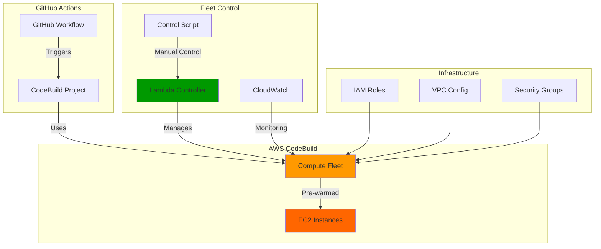

# AWS CodeBuild Compute Fleet Module

A Terraform module that creates a pre-warmed EC2 instance fleet for AWS CodeBuild projects, with automated scaling control via Lambda functions.

## 🎯 Overview

This module provides:
- **Pre-warmed EC2 instances** for faster CodeBuild execution
- **Automated fleet scaling** via Lambda function
- **Manual control** for cost optimization
- **VPC integration** for secure networking
- **CloudWatch monitoring** with dashboards

## 🏗️ Architecture



## 🚀 Features

### **Compute Fleet**
- Pre-warmed EC2 instances for faster builds
- Configurable capacity (base, target, min, max)
- VPC integration with private subnets
- Automatic scaling based on demand

### **Lambda Controller**
- **Start/Stop**: Manual fleet control with automatic scheduler management
- **Status**: Check fleet capacity and utilization
- **Init**: Initialize fleet with target capacity
- **Automated**: Scheduled scaling with timezone-aware scheduling
- **Smart Scheduling**: Multiple schedule types (business_hours, weekend, custom, smart)
- **Scheduler Control**: Independent enable/disable EventBridge scheduler

### **Monitoring**
- CloudWatch dashboard for fleet metrics
- Fleet capacity and utilization tracking
- Cost optimization insights

## 📋 Usage

### **Basic Configuration**
```hcl
module "compute_fleet" {
  source = "./modules/compute-fleet"

  fleet_name         = "my-codebuild-fleet"
  base_capacity      = 1
  target_capacity    = 2
  max_capacity       = 10
  min_capacity       = 0

  vpc_id             = module.vpc.vpc_id
  private_subnet_ids = module.vpc.private_subnet_ids
  security_group_id  = aws_security_group.codebuild_sg.id
}
```

### **CodeBuild Integration**
```hcl
resource "aws_codebuild_project" "example" {
  # ... other configuration ...

  environment {
    type         = "LINUX_CONTAINER"
    compute_type = "BUILD_GENERAL1_SMALL"  # Required when using fleet

    fleet {
      fleet_arn = module.compute_fleet.fleet_arn
    }
  }
}
```

## 🎮 Manual Control

### **Using Control Script**
```bash
# Start fleet (enables scheduler automatically)
./scripts/fleet_control.sh start

# Stop fleet (disables scheduler automatically)
./scripts/fleet_control.sh stop

# Check status
./scripts/fleet_control.sh status

# Initialize fleet
./scripts/fleet_control.sh init

# Scheduled control (timezone-aware)
./scripts/fleet_control.sh scheduled_control
SCHEDULE_TYPE=smart ./scripts/fleet_control.sh scheduled_control
SCHEDULE_TYPE=weekend ./scripts/fleet_control.sh scheduled_control

# Independent scheduler control
./scripts/fleet_control.sh enable_scheduler
./scripts/fleet_control.sh disable_scheduler
```

### **Using GitHub Actions**

#### **Manual Fleet Control Workflow**
Go to **Actions** → **Fleet Control** → **Run workflow** to manually control the fleet:

- **Action**: Choose from status, start, stop, monitor, etc.
- **Target Capacity**: Set capacity for start action
- **Project Names**: Specify projects for switch actions
- **Schedule Type**: Choose schedule type for scheduled_control

**Note**: Automated fleet control is handled by EventBridge + Lambda, not GitHub Actions.

#### **Using in Other Workflows**
```yaml
- name: 'Start fleet for build'
  uses: ./.github/actions/fleet-control
  with:
    action: 'start'
    target_capacity: '3'

- name: 'Stop fleet after build'
  uses: ./.github/actions/fleet-control
  with:
    action: 'stop'
```

### **Using AWS CLI**
```bash
# Start fleet
aws lambda invoke \
  --function-name my-fleet-controller \
  --payload '{"action": "start"}' \
  --cli-binary-format raw-in-base64-out \
  response.json

# Stop fleet
aws lambda invoke \
  --function-name my-fleet-controller \
  --payload '{"action": "stop"}' \
  --cli-binary-format raw-in-base64-out \
  response.json
```

## 📊 Monitoring

### **CloudWatch Dashboard**
- Fleet capacity metrics
- Utilization tracking
- Cost optimization insights
- Performance monitoring

### **Key Metrics**
- `FleetCapacity`: Current fleet capacity
- `FleetUtilization`: Fleet utilization percentage
- `BuildDuration`: Average build times
- `CostPerBuild`: Cost optimization metrics

## 🔧 Configuration

### **Required Variables**
- `fleet_name`: Name of the compute fleet
- `vpc_id`: VPC ID for fleet networking
- `private_subnet_ids`: Private subnet IDs
- `security_group_id`: Security group for fleet instances

### **Optional Variables**
- `base_capacity`: Base fleet capacity (default: 1)
- `target_capacity`: Target fleet capacity (default: 2)
- `max_capacity`: Maximum fleet capacity (default: 10)
- `min_capacity`: Minimum fleet capacity (default: 0)
- `enable_scheduled_control`: Enable scheduled scaling (default: false)

## 💰 Cost Optimization

### **Best Practices**
1. **Stop fleet during off-hours** using Lambda controller
2. **Monitor utilization** via CloudWatch dashboard
3. **Adjust capacity** based on build patterns
4. **Use scheduled scaling** for predictable workloads
5. **Timezone-aware scheduling** for DST-safe automation

### **Cost Savings**
- **Pre-warmed instances**: Faster builds = lower costs
- **Manual control**: Stop fleet when not needed
- **Efficient scaling**: Right-size capacity for demand
- **VPC optimization**: Reduced data transfer costs

## 🔒 Security

### **IAM Permissions**
- Fleet service role with minimal required permissions
- Lambda execution role for fleet control
- VPC and networking permissions
- CloudWatch logging permissions

### **Network Security**
- VPC integration with private subnets
- Security group restrictions
- No public internet access (NAT gateway required)

## 🌍 Timezone-Aware Scheduling

### **Problem Solved**
The original EventBridge schedule used `cron(0 */2 * * ? *)` (every 2 hours), which can cause issues during daylight saving time transitions in timezones that observe DST.

### **Solution**
Implemented a **timezone-aware scheduling system** that handles DST transitions automatically.

### **Key Features**

#### **1. Fixed Schedule Times**
- **Old**: `cron(0 */2 * * ? *)` (every 2 hours)
- **New**: `cron(0 8,12,16,20 * * ? *)` (8 AM, 12 PM, 4 PM, 8 PM UTC daily)

#### **2. Timezone-Aware Logic**
The Lambda function includes intelligent timezone handling:

```python
# Use a simple offset approach for Eastern Time (EST/EDT)
# EST = UTC-5, EDT = UTC-4 (DST)
eastern_offset = -5  # Default to EST (UTC-5)

# Simple DST detection: March 2nd Sunday to November 1st Sunday
is_dst = (
    (current_month > 3 and current_month < 11) or  # April-October
    (current_month == 3 and current_day >= 8 + (6 - current_weekday) % 7) or  # March 2nd Sunday onwards
    (current_month == 11 and current_day < 1 + (6 - current_weekday) % 7)  # November before 1st Sunday
)

if is_dst:
    eastern_offset = -4  # EDT (UTC-4)

eastern_now = utc_now + datetime.timedelta(hours=eastern_offset)
```

#### **3. Schedule Types**

| Type | Description | Time Range |
|------|-------------|------------|
| `business_hours` | Monday-Friday, 8 AM - 6 PM Eastern | Standard business hours |
| `weekend` | Fleet off on weekends | Weekend detection |
| `custom` | Monday-Friday, 9 AM - 5 PM Eastern | Traditional work hours |
| `smart` | Monday-Friday, 7 AM - 7 PM Eastern | Extended hours for remote work |

#### **4. DST Transition Handling**

The system automatically detects DST transitions:
- **DST Start**: Second Sunday in March (March 8-14)
- **DST End**: First Sunday in November (November 1-7)
- **Offset Adjustment**: EST (UTC-5) ↔ EDT (UTC-4)

### **Benefits**

1. **No DST Issues**: Fixed schedule times prevent timing problems during transitions
2. **Automatic Adjustment**: Lambda function handles timezone conversion automatically
3. **Flexible Scheduling**: Multiple schedule types for different work patterns
4. **Cost Optimization**: Smart scheduling reduces unnecessary fleet usage
5. **Production Ready**: Handles edge cases and timezone complexities

### **Usage**

```bash
# Manual testing
bash ../scripts/fleet_control.sh scheduled_control
SCHEDULE_TYPE=smart bash ../scripts/fleet_control.sh scheduled_control
SCHEDULE_TYPE=weekend bash ../scripts/fleet_control.sh scheduled_control

# EventBridge automatically runs every 4 hours (8 AM, 12 PM, 4 PM, 8 PM UTC)
```

### **Monitoring**

Check EventBridge rule status:
```bash
aws events describe-rule --name codebuild-runners-fleet-schedule --region us-east-1
```

The system now provides **robust, timezone-aware fleet control** that works reliably across DST transitions and different timezones.

## 🎛️ Enhanced Scheduler Control

### **Automatic Scheduler Management**
The `start` and `stop` commands now automatically manage the EventBridge scheduler:

- **`start` command**: Enables the EventBridge scheduler automatically
- **`stop` command**: Disables the EventBridge scheduler automatically
- **Response includes**: Scheduler status in the response

### **Independent Scheduler Control**
You can also control the scheduler independently:

```bash
# Enable scheduler without changing fleet capacity
./scripts/fleet_control.sh enable_scheduler

# Disable scheduler without changing fleet capacity
./scripts/fleet_control.sh disable_scheduler
```

### **Benefits**
1. **True "Off" State**: When you stop the fleet, the scheduler is also disabled, preventing automatic re-enabling
2. **Flexible Control**: Independent scheduler control allows fine-grained management
3. **Cost Optimization**: Complete shutdown of automated processes when not needed
4. **Manual Override**: You can disable the scheduler while keeping the fleet running

## 🚨 Troubleshooting

### **Common Issues**
1. **Permission errors**: Check IAM roles and policies
2. **VPC configuration**: Ensure subnets and security groups are correct
3. **Fleet initialization**: Verify Lambda function execution
4. **Capacity issues**: Check fleet scaling configuration

### **Debug Commands**
```bash
# Check fleet status
aws codebuild batch-get-fleets --names my-fleet

# Test Lambda function
aws lambda invoke --function-name my-fleet-controller --payload '{"action": "status"}'

# Check CloudWatch logs
aws logs describe-log-streams --log-group-name /aws/lambda/my-fleet-controller
```

## 📝 License

This module is part of the AWS CodeBuild Docker Image project.
