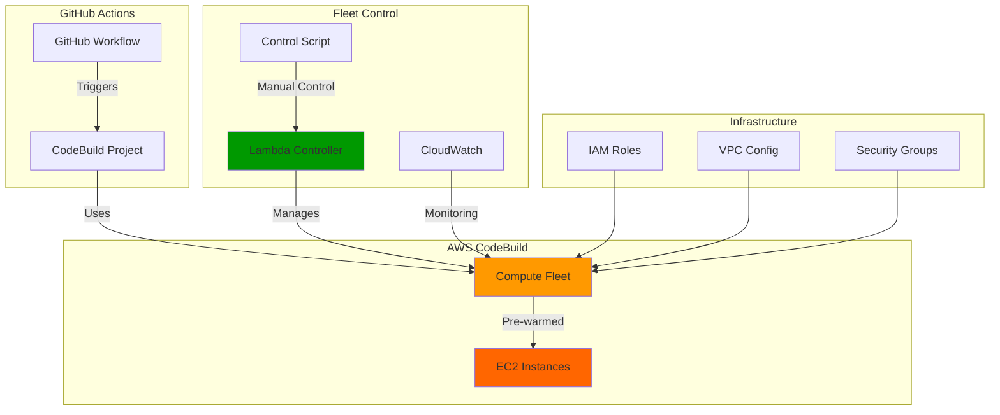

# AWS CodeBuild Compute Fleet Module

A Terraform module that creates a pre-warmed EC2 instance fleet for AWS CodeBuild projects, with automated scaling control via Lambda functions.

## 🎯 Overview

This module provides:
- **Pre-warmed EC2 instances** for faster CodeBuild execution
- **Automated fleet scaling** via Lambda function
- **Manual control** for cost optimization
- **VPC integration** for secure networking
- **CloudWatch monitoring** with dashboards

## 🏗️ Architecture



## 🚀 Features

### **Compute Fleet**
- Pre-warmed EC2 instances for faster builds
- Configurable capacity (base, target, min, max)
- VPC integration with private subnets
- Automatic scaling based on demand

### **Lambda Controller**
- **Start/Stop**: Manual fleet control
- **Status**: Check fleet capacity and utilization
- **Init**: Initialize fleet with target capacity
- **Automated**: Scheduled scaling (optional)

### **Monitoring**
- CloudWatch dashboard for fleet metrics
- Fleet capacity and utilization tracking
- Cost optimization insights

## 📋 Usage

### **Basic Configuration**
```hcl
module "compute_fleet" {
  source = "./modules/compute-fleet"

  fleet_name         = "my-codebuild-fleet"
  base_capacity      = 1
  target_capacity    = 2
  max_capacity       = 10
  min_capacity       = 0

  vpc_id             = module.vpc.vpc_id
  private_subnet_ids = module.vpc.private_subnet_ids
  security_group_id  = aws_security_group.codebuild_sg.id
}
```

### **CodeBuild Integration**
```hcl
resource "aws_codebuild_project" "example" {
  # ... other configuration ...

  environment {
    type         = "LINUX_CONTAINER"
    compute_type = "BUILD_GENERAL1_SMALL"  # Required when using fleet

    fleet {
      fleet_arn = module.compute_fleet.fleet_arn
    }
  }
}
```

## 🎮 Manual Control

### **Using Control Script**
```bash
# Start fleet
./scripts/fleet_control.sh start

# Stop fleet (save costs)
./scripts/fleet_control.sh stop

# Check status
./scripts/fleet_control.sh status

# Initialize fleet
./scripts/fleet_control.sh init
```

### **Using AWS CLI**
```bash
# Start fleet
aws lambda invoke \
  --function-name my-fleet-controller \
  --payload '{"action": "start"}' \
  --cli-binary-format raw-in-base64-out \
  response.json

# Stop fleet
aws lambda invoke \
  --function-name my-fleet-controller \
  --payload '{"action": "stop"}' \
  --cli-binary-format raw-in-base64-out \
  response.json
```

## 📊 Monitoring

### **CloudWatch Dashboard**
- Fleet capacity metrics
- Utilization tracking
- Cost optimization insights
- Performance monitoring

### **Key Metrics**
- `FleetCapacity`: Current fleet capacity
- `FleetUtilization`: Fleet utilization percentage
- `BuildDuration`: Average build times
- `CostPerBuild`: Cost optimization metrics

## 🔧 Configuration

### **Required Variables**
- `fleet_name`: Name of the compute fleet
- `vpc_id`: VPC ID for fleet networking
- `private_subnet_ids`: Private subnet IDs
- `security_group_id`: Security group for fleet instances

### **Optional Variables**
- `base_capacity`: Base fleet capacity (default: 1)
- `target_capacity`: Target fleet capacity (default: 2)
- `max_capacity`: Maximum fleet capacity (default: 10)
- `min_capacity`: Minimum fleet capacity (default: 0)
- `enable_scheduled_control`: Enable scheduled scaling (default: false)

## 💰 Cost Optimization

### **Best Practices**
1. **Stop fleet during off-hours** using Lambda controller
2. **Monitor utilization** via CloudWatch dashboard
3. **Adjust capacity** based on build patterns
4. **Use scheduled scaling** for predictable workloads

### **Cost Savings**
- **Pre-warmed instances**: Faster builds = lower costs
- **Manual control**: Stop fleet when not needed
- **Efficient scaling**: Right-size capacity for demand
- **VPC optimization**: Reduced data transfer costs

## 🔒 Security

### **IAM Permissions**
- Fleet service role with minimal required permissions
- Lambda execution role for fleet control
- VPC and networking permissions
- CloudWatch logging permissions

### **Network Security**
- VPC integration with private subnets
- Security group restrictions
- No public internet access (NAT gateway required)

## 🚨 Troubleshooting

### **Common Issues**
1. **Permission errors**: Check IAM roles and policies
2. **VPC configuration**: Ensure subnets and security groups are correct
3. **Fleet initialization**: Verify Lambda function execution
4. **Capacity issues**: Check fleet scaling configuration

### **Debug Commands**
```bash
# Check fleet status
aws codebuild batch-get-fleets --names my-fleet

# Test Lambda function
aws lambda invoke --function-name my-fleet-controller --payload '{"action": "status"}'

# Check CloudWatch logs
aws logs describe-log-streams --log-group-name /aws/lambda/my-fleet-controller
```

## 📝 License

This module is part of the AWS CodeBuild Docker Image project.
